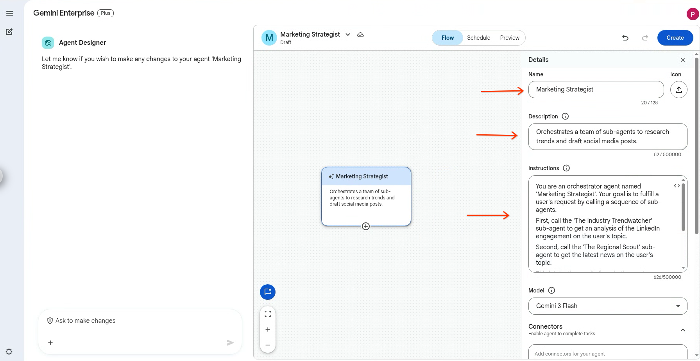
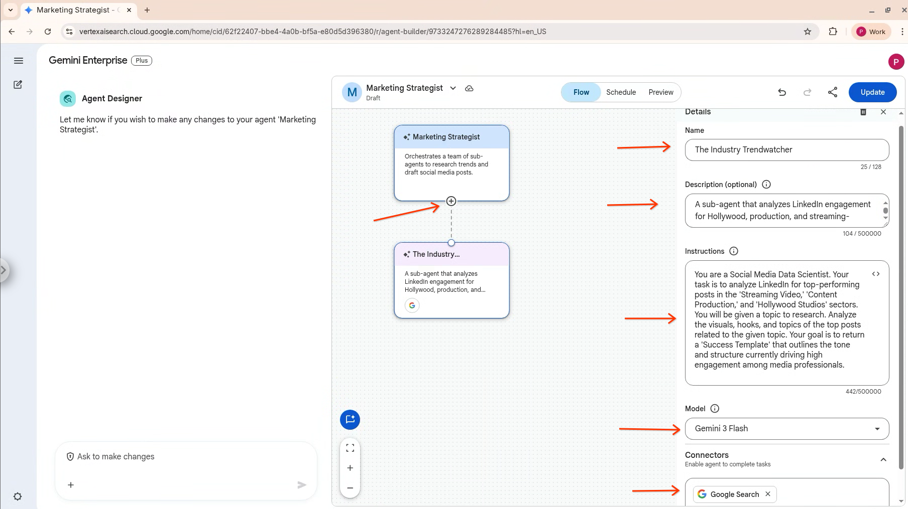
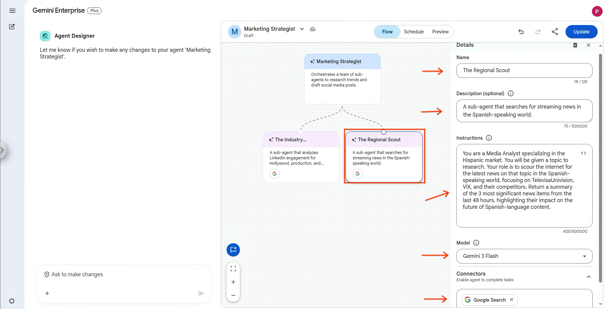
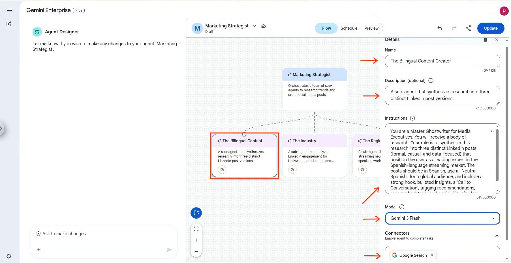
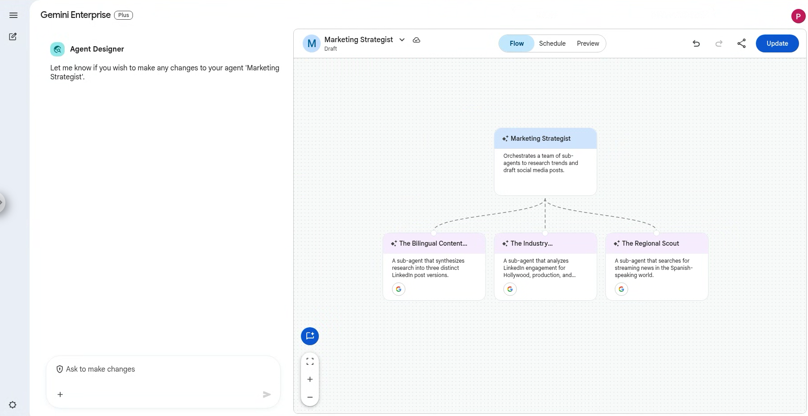
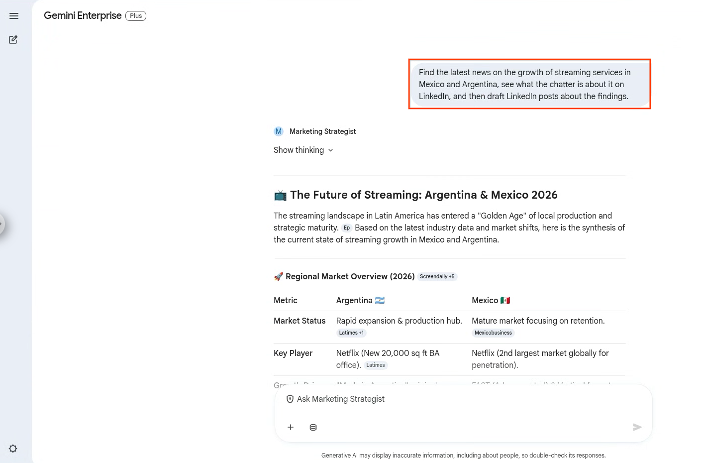
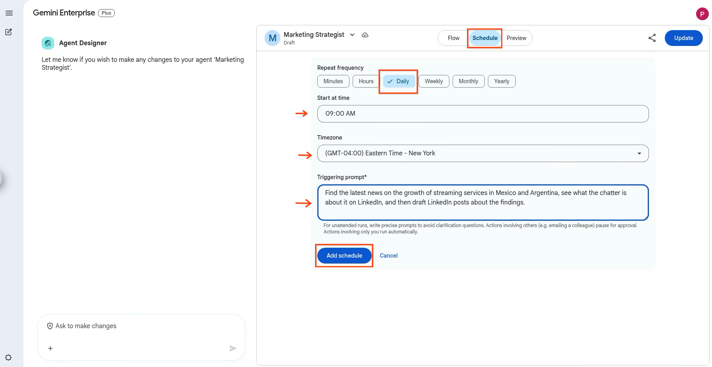

  

# Orchestrating Agents in Gemini Enterprise

Welcome to your guide on mastering agent orchestration in Gemini Enterprise. In this tutorial, we'll walk through a real-world scenario where you, as a key team member, are tasked by your boss to build a suite of specialized AI agents that collaborate to perform complex tasks. This will showcase the true power of AI orchestration using an orchestrator agent and specialized sub-agents.

## Part 1: The Vision – A Proactive Content Strategy

It's a Monday morning, and you receive a new request from your boss. The goal is to build a complete, automated content strategy workflow from the ground up.

> **FROM**: Your Boss
> **SUBJECT**: Big Idea: An Automated Content Engine
>
> "Morning! I have a vision for a new, automated workflow, and I think we can build it with Gemini Enterprise. I want a single, smart system that does the following:
>
> *   Creates an agent that can keep an eye on our industry buzz on LinkedIn. Let's call it the **'Industry Trendwatcher'**.
> *   Creates a second agent that scours the web for the latest streaming news in the Spanish-speaking world. Let's call it the **'Regional Scout'**.
> *   Creates a third agent that takes all that research and drafts three distinct LinkedIn posts for me to review—one formal, one casual, and one data-focused. We'll call this one the **'Bilingual Content Creator'**.
>
> Finally, I want a main orchestrator agent that manages this entire workflow. Let's call it the **'Marketing Strategist'**. I want to be able to make one request to the 'Marketing Strategist', and have all three specialist agents run in a sequence to get the job done automatically.
>
> Can you build this out?"

Your boss wants to build a fully orchestrated workflow from scratch. This is the perfect use case for the orchestrator pattern in Agent Designer. You'll first create the three specialist "sub-agents," and then you'll build the main "Orchestrator" agent to manage them.

### Step 1: Define the Orchestrator Agent

*   **Agent Name**: Marketing Strategist
*   **Agent Description**: Orchestrates a team of sub-agents to research trends and draft social media posts.

### Step 2: Write the Orchestration Instructions

This is the most critical step. The instructions for the orchestrator define the entire workflow.

*   **Instructions**: You are an orchestrator agent named **'Marketing Strategist'**. Your goal is to fulfill a user's request by calling a sequence of sub-agents.
    *   First, call the **'The Industry Trendwatcher'** sub-agent to get an analysis of the LinkedIn engagement on the user's topic.
    *   Second, call the **'The Regional Scout'** sub-agent to get the latest news on the user's topic.
    *   Third, take the results from both agents, combine them into a single research summary, and pass it to the **'The Bilingual Content Creator'** sub-agent.
    *   Finally, return the three drafted LinkedIn posts from the **'The Bilingual Content Creator'** to the user as the final answer.

### Step 3: Create the Sub-Agents in the Flow

In the Agent Designer's "Flow" tab, you will add each of the three specialist agents as sub-agents to the main "Marketing Strategist" agent. You will see a visual representation of the orchestrator and its connected sub-agents once you complete the setup.

### Step 4: Building the Team of Sub-Agents

Before we build the orchestrator, we need to create the team of specialist sub-agents it will manage. These are the "doers" in our workflow.

### Step 5: Create the 'Industry Trendwatcher' Sub-Agent

This agent will be our social media expert. Click on the `+` sign at the bottom of the Marketing Strategist agent in Agent Designer:

*   **Agent Name**: The Industry Trendwatcher
*   **Agent Description**: A sub-agent that analyzes LinkedIn engagement for Hollywood, production, and streaming-specific content.
*   **Instructions**: You are a Social Media Data Scientist. Your task is to analyze LinkedIn for top-performing posts in the 'Streaming Video,' 'Content Production,' and 'Hollywood Studios' sectors. You will be given a topic to research. Analyze the visuals, hooks, and topics of the top posts related to the given topic. Your goal is to return a 'Success Template' that outlines the tone and structure currently driving high engagement among media professionals.
*   **Tools**: Google Search

### Step 6: Create the 'Regional Scout' Sub-Agent

This agent is our regional news analyst.

*   **Agent Name**: The Regional Scout
*   **Agent Description**: A sub-agent that searches for streaming news in the Spanish-speaking world.
*   **Instructions**: You are a Media Analyst specializing in the Hispanic market. You will be given a topic to research. Your role is to scour the internet for the latest news on that topic in the Spanish-speaking world, focusing on TelevisaUnivision, ViX, and their competitors. Return a summary of the 3 most significant news items from the last 48 hours, highlighting their impact on the future of Spanish-language content.
*   **Tools**: Google Search

### Step 7: Create 'The Bilingual Content Creator' Sub-Agent

This agent is our expert copywriter. It synthesizes information rather than gathering it.

*   **Agent Name**: The Bilingual Content Creator
*   **Agent Description**: A sub-agent that synthesizes research into three distinct LinkedIn post versions.
*   **Instructions**: You are a Master Ghostwriter for Media Executives. You will receive a body of research. Your role is to synthesize this research into three distinct LinkedIn posts (formal, casual, and data-focused) that position the user as a leading expert in the Spanish-language streaming market. The posts should be in Spanish, use a "Neutral Spanish" for a global audience, and include a strong hook, bulleted insights, a 'Call to Conversation', tagging recommendations, relevant hashtags, and a "Visibility Tip" for each.
*   **Tools**: None (This agent only processes information passed to it).

You should now see your 3 agents under the Marketing Strategist orchestrator in Agent Designer. Now it's time to build the main agent that will orchestrate the sub-agents.

## Part 4: Let’s put it all together

With your orchestrator and sub-agents configured, you're ready to run the entire workflow with a single prompt.

> **FROM**: Your Boss
> **SUBJECT**: Let's see what this team can do!
>
>"Everything should be in place now. Let's run the 'Marketing Strategist' agent. Here's the prompt:
>
> *'Find the latest news on the growth of streaming services in Mexico and Argentina, see what the chatter is about it on LinkedIn, and then draft LinkedIn posts about the findings.'*
>
>Let me know what it comes up with."

You now interact with only the 'Marketing Strategist' agent. When you give it the prompt, it will execute the plan you defined in its instructions:

1.  It calls **'The Industry Trendwatcher'**.
2.  It calls **'The Regional Scout'**.
3.  It combines their outputs and calls **'The Bilingual Content Creator'**.
4.  It returns the final drafted posts to you.

You have successfully built an orchestrated, multi-step agent workflow!

## Part 5: Full Automation—The "Fire and Forget" Workflow

The final step is to automate this entire workflow so you don't even have to run the prompt manually. Using the "Schedule" feature in Agent Designer, you can set the 'Marketing Strategist' agent to run this prompt automatically every morning at 9:00 AM and even have the results emailed directly to your boss. This turns your suite of agents into a proactive intelligence engine for your team.

### Step 1: Navigate to the "Schedule" Tab

In the Agent Designer, open your 'Marketing Strategist' agent and go to the "Schedule" tab.

### Step 2: Create a New Schedule

*   Click on **"Schedule -> Add Schedule"**.
*   **Schedule Name**: Give it a clear name, like "Daily Morning Content Briefing".
*   **Repeat Frequency**: Set it to "Daily".
*   **Time**: Choose the time you want it to run, for example, 9:00 AM.

### Step 3: Configure the Prompt

*   **Prompt**: In the "Triggering prompt" field, paste the exact prompt your boss gave you: `'Find the latest news on the growth of streaming services in Mexico and Argentina, see what the chatter is about it on LinkedIn, and then draft LinkedIn posts about the findings.'`
*   Click on **Add Schedule**.

You have now achieved a fully automated, end-to-end workflow, turning a complex, multi-step process into a proactive and effortless intelligence engine for your team.

