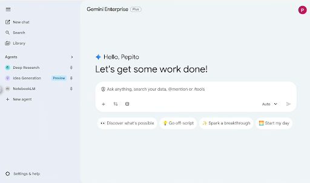
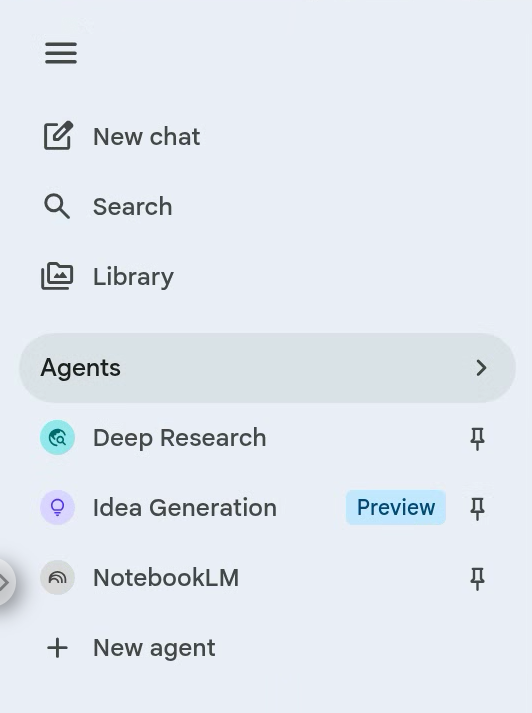
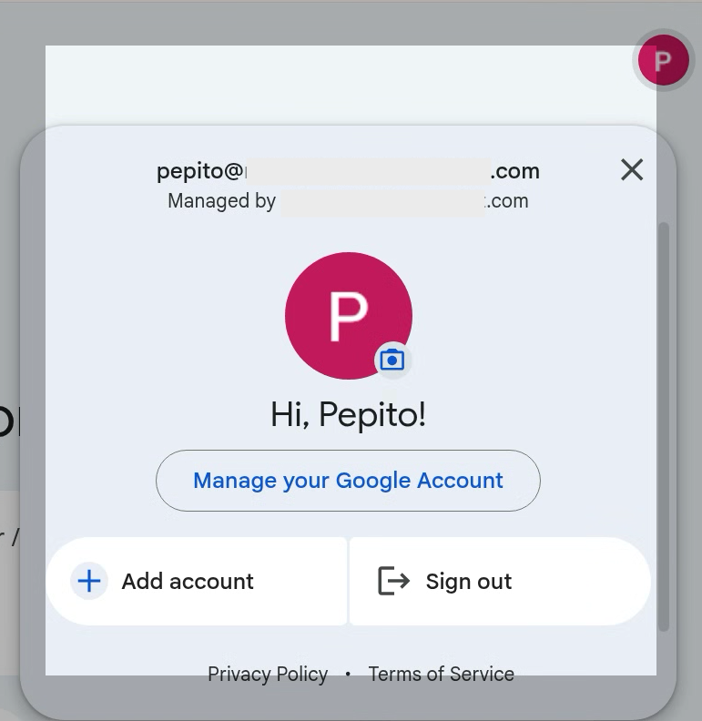
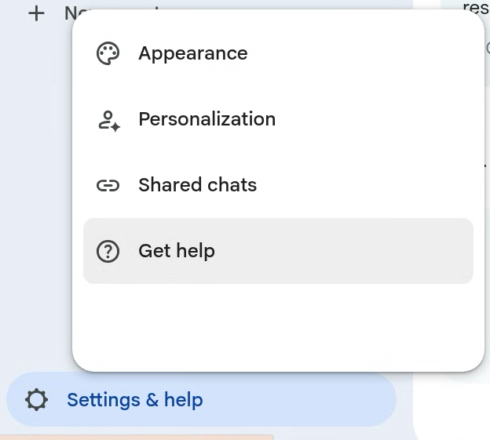
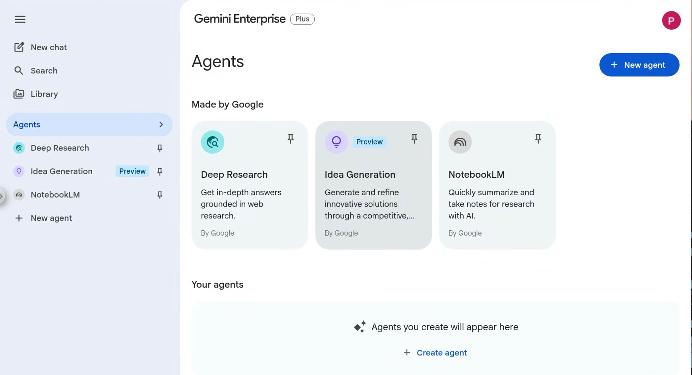

# Navigating Gemini Enterprise: A Guide to Your AI Workplace

Welcome to Gemini Enterprise, your new front door for AI in the workplace! This guide will walk you through the platform's key areas, empowering you to discover, create, and manage AI-powered workflows in a secure environment.

### Click here to watch a brief video of the basics of Gemini Enterprise

## 1. The Main Interface: Your AI Command Center

This area is the central prompt bar of the Gemini Enterprise interface, designed to be the primary interaction point for both general queries and organization-wide data analysis.

### Key Features and Symbols

*   **"Ask anything, search your data"**: This indicates the platform's ability to perform multimodal searches across your organization's connected data sources, such as Google Workspace, Jira, or Microsoft SharePoint.
*   **@mention**: Similar to social platforms, using `@` allows you to tag specific agents (like Deep Research) or directly reference specific data sources and files for more grounded responses.
*   **/tools**: Typing a forward slash provides quick access to built-in features like Canvas (for document creation), Create images, or Deep Research.
*   **Icon Tray (Bottom Left)**:
    *   **Plus (+)**: Used for uploading files or adding images to your prompt.
    *   **Slider/Settings Icon**: Typically used to configure data connectors or refine how Gemini accesses information.
    *   **Database Icon**: Represents the ability to select and manage connected enterprise data stores.
*   **Model Selector (Bottom Right)**: The "Auto" dropdown allows you to choose between different Gemini models or let the system automatically select the best one for your specific task.
*   **Suggestion chips** (also known as prompt starters), which are interactive buttons designed to help users quickly initiate common or creative tasks within the Gemini Enterprise interface.

### Functionality

*   **Quick Start**: These chips act as one-tap shortcuts to refine topics or discover next steps, making it faster to interact than typing a full manual prompt.
*   **Contextual Assistance**: When a user selects a chip, that specific text is added to the conversation as the user's initial response, guiding the AI's output toward a specific goal or tone.

While specific chip labels can vary based on your organization's data and history, the examples in your image represent common "on-ramp" actions:

*   **👀 Discover what's possible**: Typically initiates a guided tour or a list of examples showing how to use Gemini with your specific enterprise data and tools.
*   **💡 Go off-script**: Encourages more creative, less structured brainstorming or unconventional problem-solving.
*   **✨ Spark a breakthrough**: Often used for high-level strategic thinking, such as synthesizing complex data into new insights or "big bet" initiatives.
*   **🌅 Start my day**: A productivity-focused shortcut that can trigger a morning briefing, summarizing unread emails, upcoming calendar events, and relevant task updates from Workspace.

## 2. The Left Navigation Panel: Your Control Center

The sidebar on the left gives you access to your history and the platform's core features.

*   **New chat**: Start a fresh conversation with Gemini.
*   **Search**: Find previous chats or content you've created.
*   **Library**: Access content you've generated, such as images or documents, and create new content from here.
*   **Agents**: This is your gateway to the world of AI agents.
    *   Quickly access pinned agents (Google-provided, third-party, or your own).
    *   Clicking "Agents" takes you to the full Agent Library where you can discover and deploy new agents.
    *   From the library, you can access the Agent Designer to build your own.

## 3. Managing Your Profile and Settings

*   **User Information (Top Right)**: Click your profile icon to verify you are signed into your organization-managed account. This confirms your work is protected by enterprise-grade data privacy and is not used to train Google's models.

    

*   **Settings & help (Bottom Left)**:
    *   **Appearance**: Toggle between Light and Dark modes.
    *   **Personalization**: Manage your activity history. In an enterprise setting, you can typically view, delete, or turn off chat history here.
    *   **Shared chats**: View and manage all public links you have created for your chats.
    *   **Get help**: Access documentation and support.

    

## 4. Agent Management: Empowering Everyone with Agents

Gemini Enterprise is an "agentic platform" that empowers everyone. The UI provides capabilities to manage and utilize AI agents effectively:

*   **Access World-Class Gemini Models**: You'll have instant access to Google's cutti
