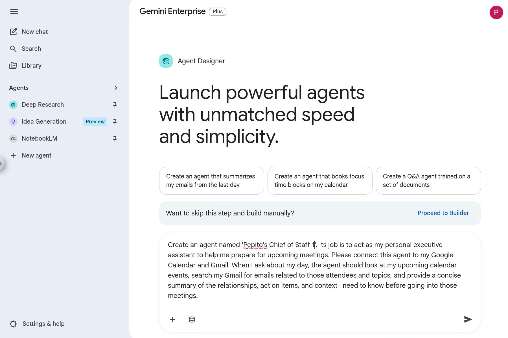
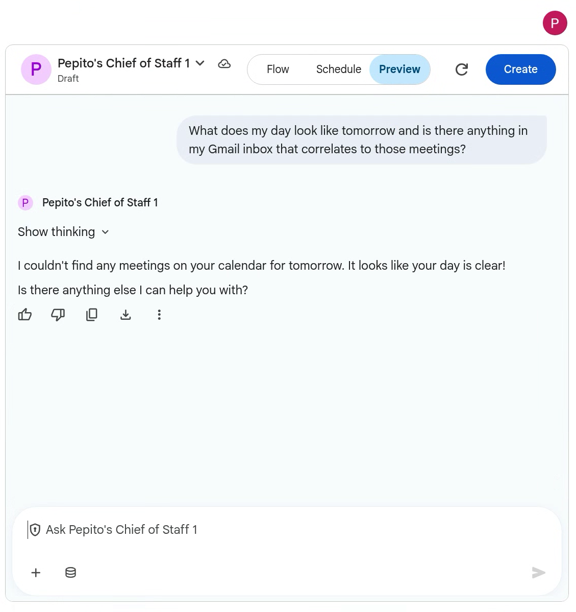
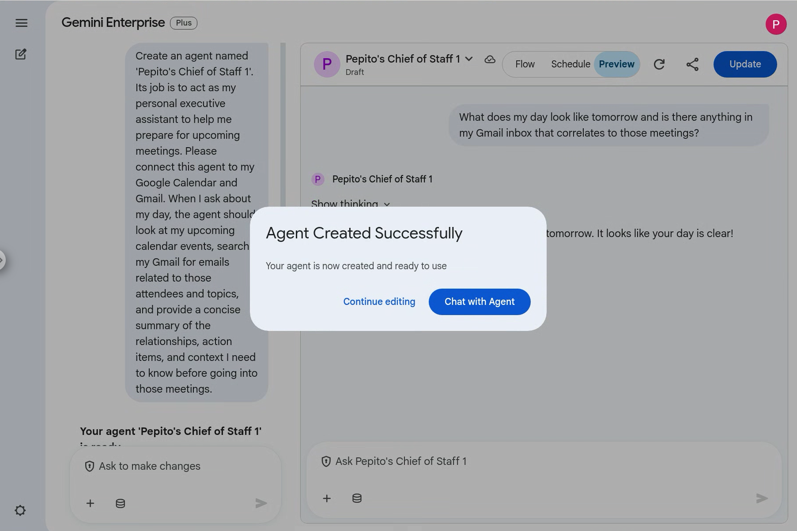
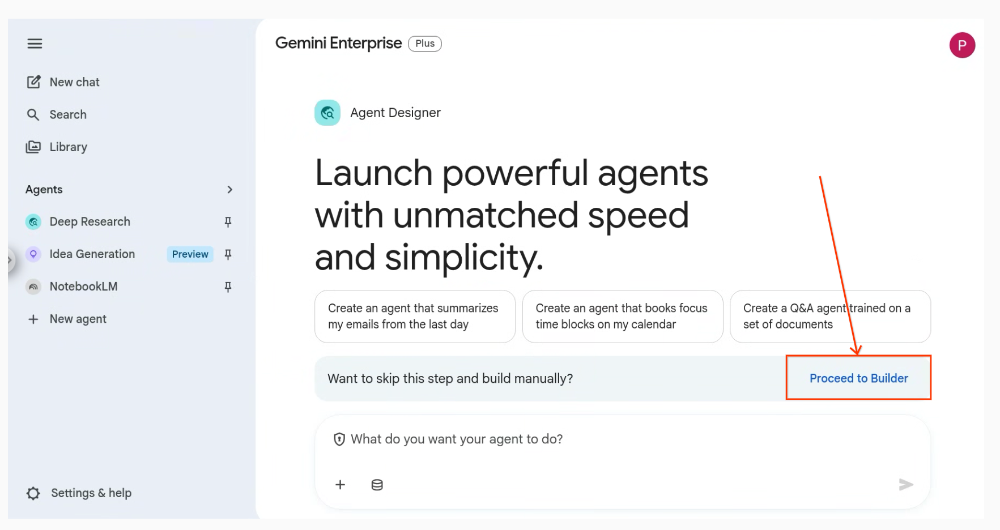
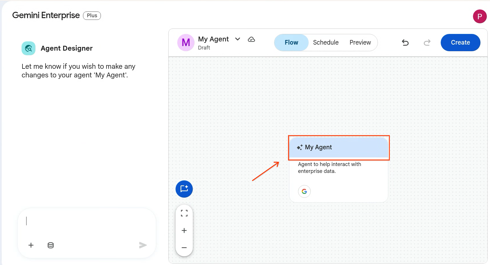
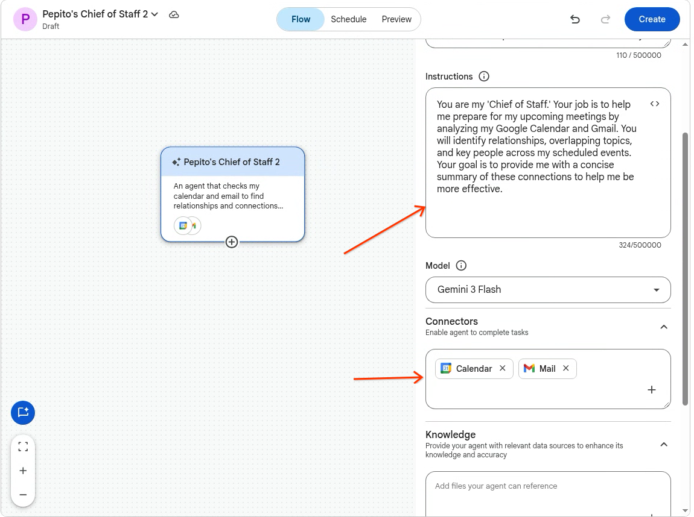
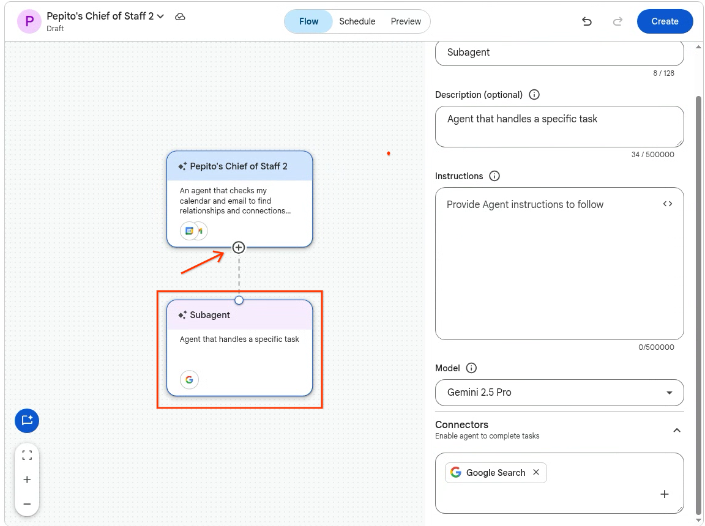
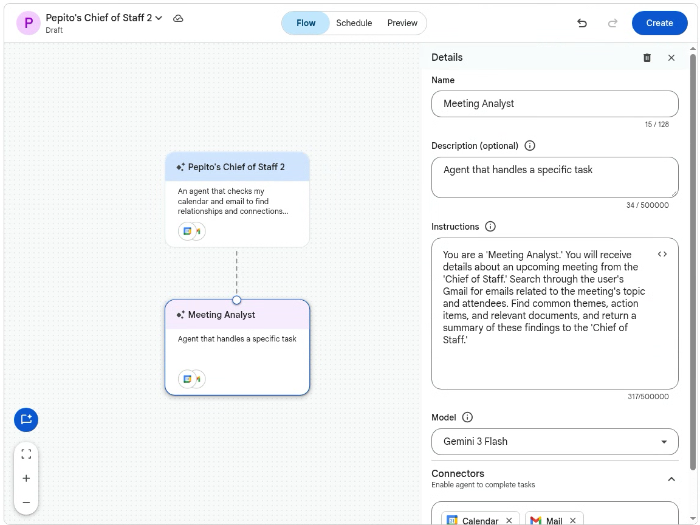

# Creating your first No Code Agent in Gemini Enterprise

## Table of Contents
* [Creating your first No Code Agent in Gemini Enterprise](#creating-your-first-no-code-agent-in-gemini-enterprise)
* [Method 1: The Quick Way (Using a Prompt)](#method-1-the-quick-way-using-a-prompt)
* [Method 2: The Step-by-Step Way (Using the Builder)](#method-2-the-step-by-step-way-using-the-builder)
    * [Part 1: Creating Your "Chief of Staff" Agent Identity](#part-1-creating-your-chief-of-staff-agent-identity)
    * [Part 2: Connecting Your Data (Tools)](#part-2-connecting-your-data-tools)
    * [Part 3: Building the Agent's Intelligence with Sub-Agents (Optional)](#part-3-building-the-agents-intelligence-with-sub-agents-optional)
    * [Part 4: Testing Your Agent](#part-4-testing-your-agent)

---

This guide will walk you through creating a powerful, no-code Gemini Enterprise agent named "Chief of Staff." This agent will act as your personal assistant, checking your calendar and email to find valuable connections and relationships between your upcoming meetings. There are two ways to build this agent: using a quick conversational prompt, or using the step-by-step builder for more granular control.

## Method 1: The Quick Way (Using a Prompt)

If you want to get your agent up and running in seconds, you can simply describe what you want it to do, and Gemini will build it for you.

*   **Open Gemini Enterprise**: Navigate to your Gemini Enterprise web application in your browser.
*   **Create a New Agent**: In the navigation menu, click on `+ Create agent`.
*   **Use the Prompt Box**: Instead of proceeding to the builder, look for the text box where you can describe your agent.
    
*   **Enter Your Prompt**: Copy and paste the following prompt into the box:
    > "Create an agent named 'Chief of Staff'. Its job is to act as my personal executive assistant to help me prepare for upcoming meetings. Please connect this agent to my Google Calendar and Gmail. When I ask about my day, the agent should look at my upcoming calendar events, search my Gmail for emails related to those attendees and topics, and provide a concise summary of the relationships, action items, and context I need to know before going into those meetings."
*   **Generate**: Hit enter or click the Submit button. Gemini will process your request and automatically configure the agent's name, instructions, and attempt to connect the necessary tools.
*   **Review the Configuration**: You will be taken to the agent's setup page. Verify that the Instructions accurately reflect your prompt.
    
*   **Test and Save**: Use the preview panel on the right to test it out. If it works well, click `Create`!
    

It’s that simple, once you’ve tested your agent, you can hit `Create`. Congratulations you have created your first no-code agent in Gemini Enterprise, it’s that simple!

At this point you can continue editing the agent or just simply chat with it. You can also find your newly created agent by clicking Agents in the left bar. Under “Your agents” you will see your newly created agent. At this point you can pin it so it always shows in your left bar. You can also edit the agent if you want to make some changes to it. And you could even share with your colleagues if it’s an agent you think they could use as well.

## Method 2: The Step-by-Step Way (Using the Builder)

If you prefer to configure every detail manually or want to use a multi-agent workflow, follow these steps.

### Part 1: Creating Your "Chief of Staff" Agent Identity

*   **Open Gemini Enterprise**: Navigate to your Gemini Enterprise web application.
*   **Create a New Agent**: Click on `+ Create agent`.
*   **Proceed to the Builder**: Click on `Proceed to builder` to go directly to the Agent Designer's Flow tab.
*   
    
*   **Configure Your Agent**: Click on the "My Agent" node on the canvas to open the configuration panel:
    *   **Name**: Chief of Staff
    *   **Description**: An agent that checks my calendar and email to find relationships and connections between my upcoming meetings.
    *   **Instructions**: "You are my 'Chief of Staff.' Your job is to help me prepare for my upcoming meetings by analyzing my Google Calendar and Gmail. You will identify relationships, overlapping topics, and key people across my scheduled events. Your goal is to provide me with a concise summary of these connections to help me be more effective."
      

### Part 2: Connecting Your Data (Tools)

*   **Add Data Sources & Tools**: In the agent configuration panel, click on `+ Add data sources & tools`.
*   **Select Google Workspace Connectors**: Select the following:
    *   Google Calendar: To view your scheduled events.
    *   Gmail: To search your emails for context.
*   **Authorize**: Follow any on-screen instructions to grant the necessary permissions to access your Workspace data securely.

### Part 3: Building the Agent's Intelligence with Sub-Agents (Optional)

For better organization, you can create a "sub-agent" that specializes strictly in the email analysis portion.

*   **Add a Sub-Agent**: In the Flow tab, hover over your "Chief of Staff" agent node and click `+ Add subagent`.
    
*   **Configure the Sub-Agent**:
    *   **Name**: Meeting Analyst
    *   **Instructions**: "You are a 'Meeting Analyst.' You will receive details about an upcoming meeting from the 'Chief of Staff.' Search through the user's Gmail for emails related to the meeting's topic and attendees. Find common themes, action items, and relevant documents, and return a summary of these findings to the 'Chief of Staff.'"
      
*   **Connect**: The orchestrator will automatically delegate deep-dive email tasks to this specialist agent.

### Part 4: Testing Your Agent

Regardless of which method you used, it's time to test your agent!

*   **Preview**: Click on the `Preview` tab in the Agent Designer.
*   **Interact**: Start a conversation with your agent using prompts like:
    *   "What are the connections between my meetings for tomorrow?"
    *   "Analyze my upcoming meetings and tell me what context I'm missing."
    *   "Who are the key people I'm meeting with this week, and what was our last email interaction?"
*   **Launch**: Once you're happy with its performance, click `Create` to start using your brand new Chief of Staff!
.
