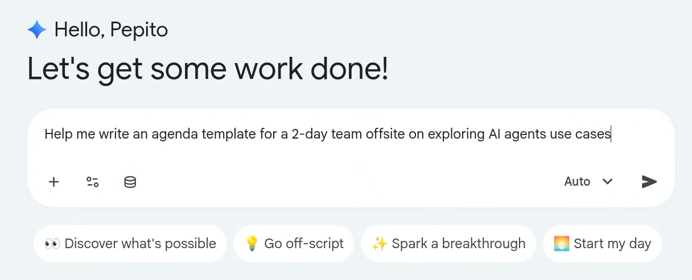
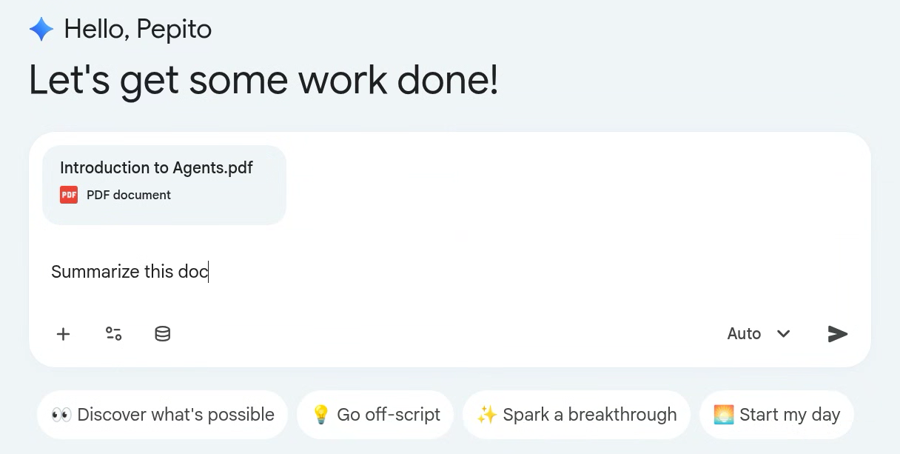
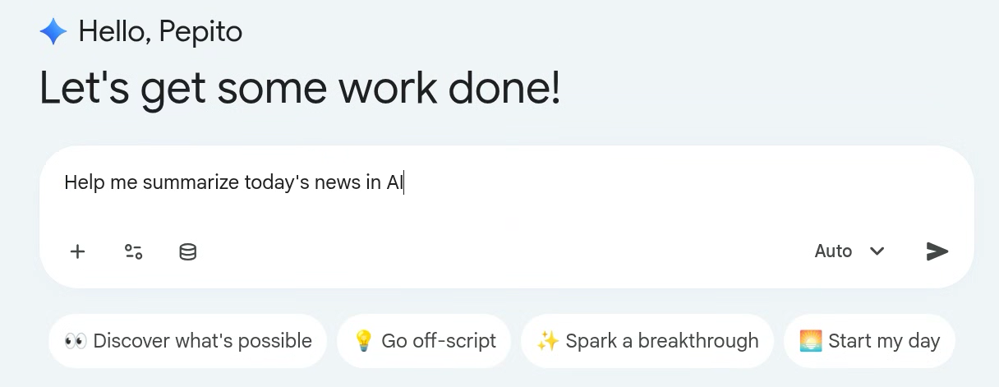
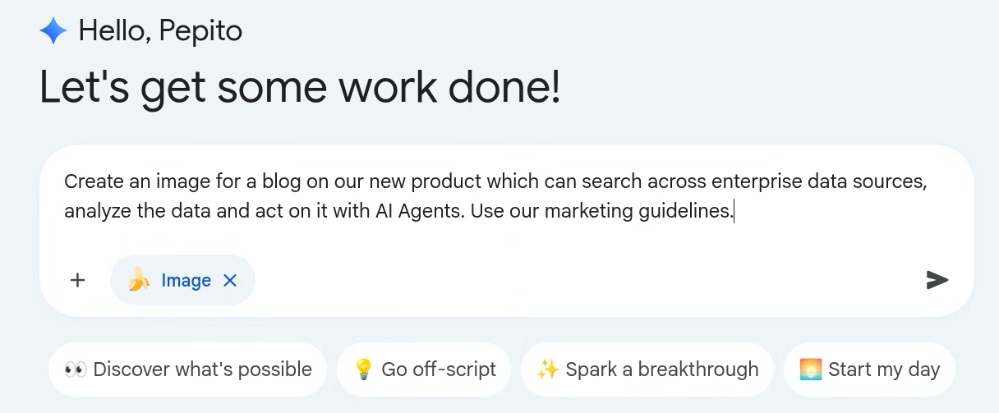
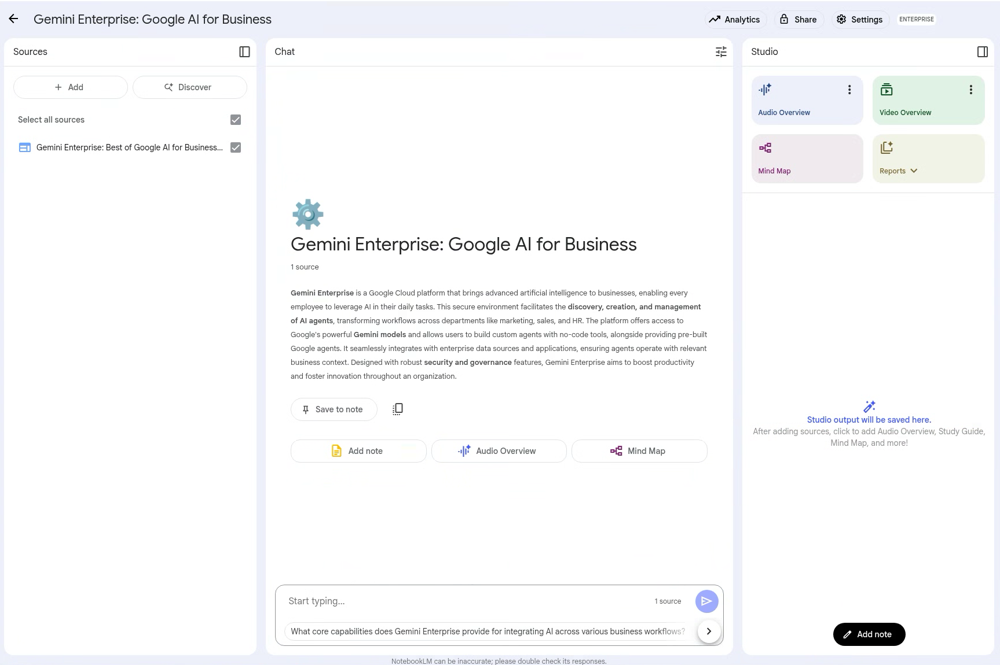
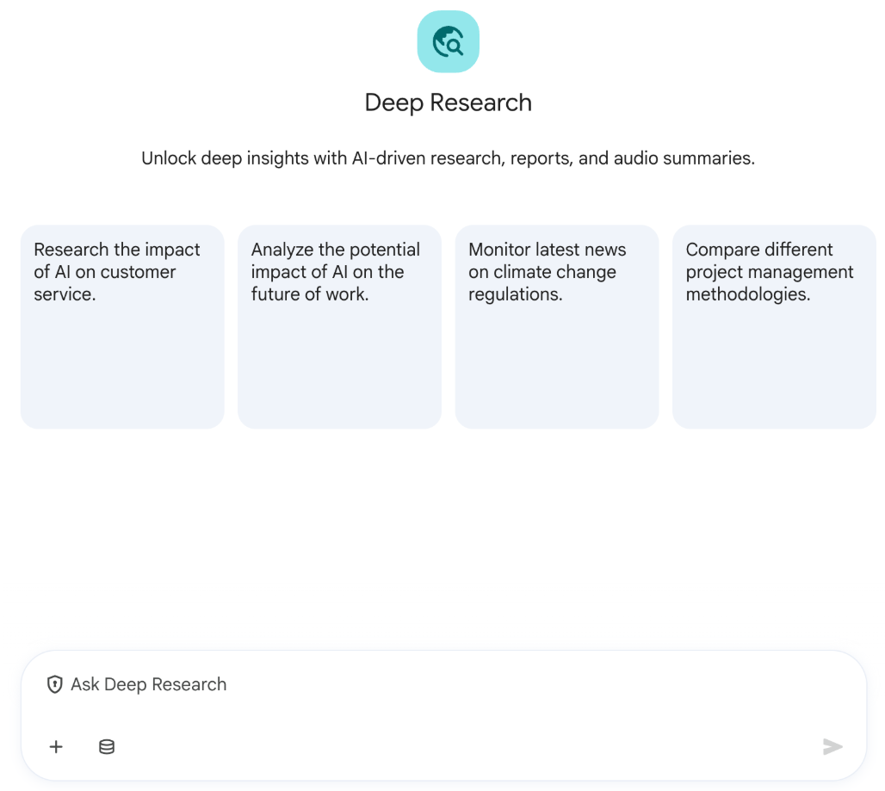
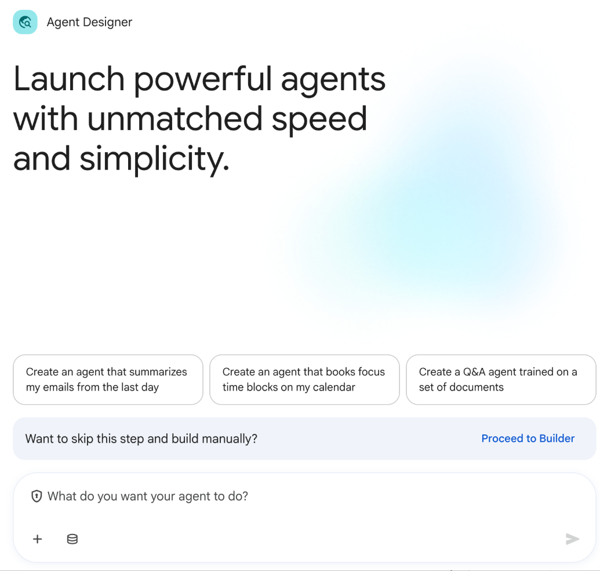
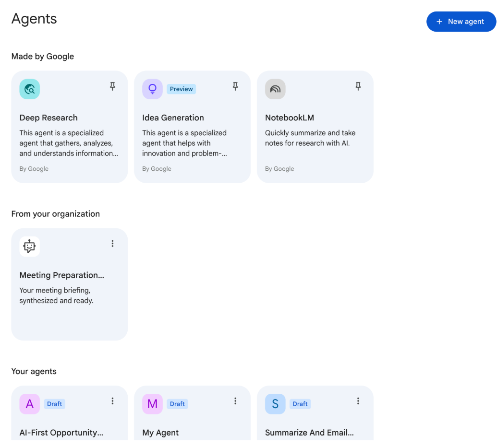

# Prompting Guide and Best Practices

You can write your own prompts to engage with Gemini and your organization’s data. You can choose which connectors Gemini Enterprise can use to find the data and the information needed to be used in the response you’re seeking. For example, if your organization has enabled the appropriate connectors, you can provide Gemini access to your SharePoint, Drive, Gmail or Outlook, Salesforce, ServiceNow, Jira, and more. To optimize your results, keep these prompt-writing tips in mind:

-   **Be specific and contextual:** More detail is usually better. Use names, dates, project titles, SKU numbers, case IDs, policy names, etc.
    -   *Instead of:* “Find sales report.”
    -   *Try:* “Find the Q1 2026 sales report for the Alpha product line in the North region.”
-   **Define the persona:** Tell Gemini Enterprise who it should act as.
    -   *Example:* “You are a friendly customer service agent. Draft an email to a customer…”
-   **Define the output format:** Tell Gemini Enterprise in what format you expect the output to be shared, and also what formats to avoid.
    -   *Examples:* “Summarize this in bullet points,” “Generate a table comparing X and Y,” “Draft a short paragraph for a slide.”
-   **Use action verbs:** Start with what you want Gemini Enterprise to do.
    -   *Examples:* “Find,” “Summarize," “Explain,” “Compare,” “Draft,” “List,”
-   **Iterate and refine:** If the first response isn't perfect, ask follow-up questions or rephrase your prompt.
    -   *Examples:* “Elaborate on Y,” “Make this more concise,” “Add a section about X.”
-   **Use NotebookLM for multi-document tasks:** When working with several sources, upload them to NotebookLM Enterprise and ask questions across them. You can also share your notebook with your colleagues.
    -   *Example (after uploading or adding reports):* "Based on these three market reports, what are the common trends identified for the next year?"
    -   There are also several multi-modal ways to interact with your data once in NotebookLM including audio podcasts, reports, infographics, and much more.

## Best Practices

**Weak Prompt:** “Create a project plan”

### Characteristics of a Good Prompt

-   **Clear Intent** - Unambiguously state the desired goal or outcome. The agent should never have to guess what you’re trying to achieve.
-   **Sufficient Context** - Provide necessary background information, constraints, and audience details for the model to perform the task accurately.
-   **Structural Clarity (PTCF)** - Organize the prompt in a way that is easy for the model to parse and understand, often by following a recognized structure like the PTCF framework.

### PTCF Framework

The PTCF Framework is a foundational and highly effective structure that ensures you cover all the critical elements for a high-performing prompt.

-   **P - Persona:** This is the role you assign to the agent to focus its knowledge. For instance, instructing it to act as a “cyber threat intelligence analyst specializing in Russian-nexus threat actors”.
-   **T - Task:** The non-negotiable action. What must the agent do? Example: “Generate a threat brief.”
-   **C - Context:** The background and constraints, which often involve the audience and time frame. Example: “...for an executive audience, covering the last 90 days.”
-   **F - Format:** How the output must look, which ensures immediate usability. Example: “Format the output as a markdown table.”

---

### What can you do?

Below are some examples of the many capabilities available with Gemini Enterprise pre-configured, even before connecting your organization and data:

-   **AI Assistant** - Generate and analyze content with secure and compliant access to the latest LLM models. Examples include:
    -   Writing an agenda template for your next team offsite
    

-   **Documents** - You can also attach one or more documents with the + icon (supports PDF, Microsoft Office, images, videos, and more). Once added, you can summarize them, translate them and more.
    

-   **External Web Search** - For the most up-to-date information, Gemini Enterprise searches the public web and answers with data grounded in Google Search.
    

-   **Media Generation** - Select from the tools menu on the chat box “Generate Images” or “Create videos” option to generate images and videos using the latest Google image and video models.
    

-   **Notebook LM** - Integrated into Gemini Enterprise, use NotebookLM Enterprise to analyze your uploaded content, ask questions, generate summaries, and even a custom podcast you can interact with.
    

-   **Deep research agent** - A Google-built AI agent that creates in-depth reports grounded in Google Search and any data connected with your company’s connectors on any topic you choose.
    

-   **Agent Designer** - Create custom AI agents using a chat interface, no code required. Automate tasks using 30+ pre-built tools and actions.
    

-   **Agent gallery** - Discover specialized agents built with any framework including Google ADK and then deploy and govern them in Gemini Enterprise.
    

-   **Gemini Code Assist** - A Google-built coding agent that helps developers simplify their workflows, speeding common development tasks by over 20%.

